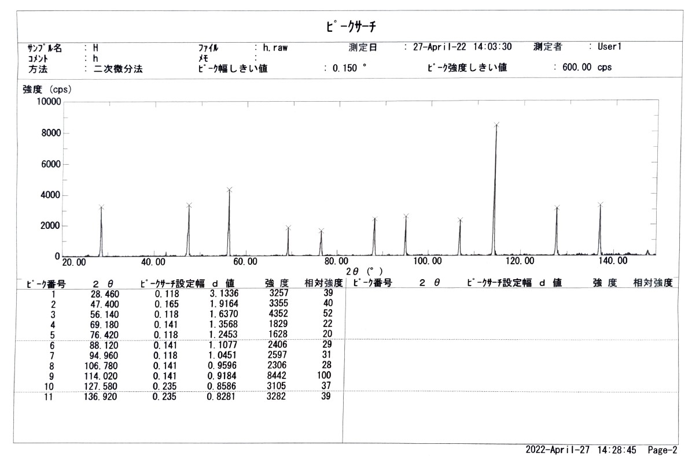
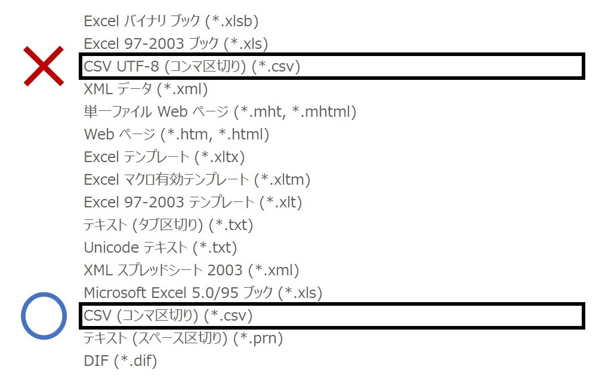

# Powder_X-ray_Diffraction
これは, 大阪大学理学部物理学科の学生が 3 年次に物理学実験 1, 2 で行う実験「 X 線と結晶構造」の解析ツールです. 
粉末 X 線回折法によって得られるピークの散乱角のリストから結晶格子の種類と格子定数を推定し, リストを指数付けします.

## 概要
これはコマンドラインツールです. 概ね次のような流れで使用します.

1. `pxrd.cpp` をコンパイルします.
2. 実験結果から「入力ファイル」を作ります.
3. ターミナルでコマンドを実行します. このとき, 入力ファイルのパスをコマンドライン引数に指定します.
4. 解析の結果, 指数付けされたピークのリストが「出力ファイル」に, 格子の種類と格子定数が「ログ」に出力されます.

## 動作環境
以下の環境で動作することを確認済みです. 

* Linux
    * Ubuntu 22.04.1 LTS
    * gcc 11.2.0
* Windows
    * Windows 10 Pro 21H2
    * gcc 11.3.0

## 使い方
### 入力ファイルを作る
実験では, 次の画像のような「ピークサーチ」のデータを取得します.



そこから, 画像左下のピーク番号と 2Θ の値を読み取って次のような CSV ファイルを作ります.

```
1,28.460
2,47.400
3,56.140
4,69.180
5,76.420
6,88.120
7,94.960
8,106.780
9,114.020
10,127.580
11,136.920
```

* エディタを使う場合は, デリミタ ( 区切り文字 ) は半角コンマ `,` としてください. スペースはあっても構いません.
* Excel を使う場合は, 保存する際に「 CSV UTF-8 ( コンマ区切り ) 」ではなく「 CSV ( コンマ区切り ) 」を選択してください. そうしないと, ファイルの先頭に BOM (byte order mark) が入って解析に失敗します. ( まあ, bom skip を実装すればいいんですけどね, 勘弁勘弁...)



### コマンドを実行する
`pxrd.cpp` をコンパイルしたら, ターミナルで次のような形式でコマンドを実行してください.

```
pxrd [OPTION] [FILE]...
```

* ここでは, `pxrd.cpp` をコンパイルした実行ファイルの名前を `pxrd` としました.
* オプションは 2 つあります.
    * `-o` : (overwrite) 入力ファイルを出力ファイルで上書きします.
    * `-l` : (log) ログを出力します. 入力ファイルは指定できません.
* オプションをつけない場合は, 入力ファイルの名前に `_out` をつけて出力ファイルを出力します.
* 入力ファイルは一度に複数指定できます.
* 以前出力されたファイルを入力ファイルに指定することもできます.

### 出力ファイルを確認する
出力ファイルは, 次のような CSV 形式で出力されます.

| number | 2theta | d^-2     | index | nr       | a       |
| :----: | :----: | :------: | :---: | :------: | :-----: |
|      1 |  28.46 | 0.101848 |     3 | 7.6054   | 5.4273  |
|      2 |  47.4  | 0.272318 |     8 | 4.1129   | 5.4201  |
|      3 |  56.14 | 0.373205 |    11 | 3.24385  | 5.42903 |
|      4 |  69.18 | 0.543218 |    16 | 2.31638  | 5.42716 |
|      5 |  76.42 | 0.644882 |    19 | 1.92394  | 5.42796 |
|      6 |  88.12 | 0.815117 |    24 | 1.41412  | 5.4262  |
|      7 |  94.96 | 0.915631 |    27 | 1.17093  | 5.43027 |
|      8 | 106.78 | 1.08607  |    32 | 0.82473  | 5.42808 |
|      9 | 114.02 | 1.18582  |    35 | 0.651421 | 5.43282 |
|     10 | 127.58 | 1.35674  |    40 | 0.392627 | 5.42977 |
|     11 | 136.92 | 1.45832  |    43 | 0.257738 | 5.4301  |

* 3 列目 `d^-2` の値は次の量を Å^-2 の単位で表した値です.

$$ \frac{1}{d^2} = \frac{4\sin^2\theta}{\lambda^2} = \frac{h^2+k^2+l^2}{a^2} $$

* 4 列目 `index` の値は Miller 指数の 2 次形式 h^2 + k^2 + l^2 の値です.
* 5 列目 `nr` の値は Nelson-Riley 関数 f(Θ) の値です. 格子定数の精密化に使用します.

$$ f(\theta) = \frac{\cos^2\theta}{\sin\theta} + \frac{\cos^2\theta}{\theta} $$

* 6 列目 `a` の値は各ピークごとに算出した格子定数 a を Å の単位で表した値です.

### ログを出力する
このツールは, 解析の結果推定された **格子の種類と格子定数をログとして出力** します. 
`-l` オプションでコマンドを実行すると, ターミナルに次のようにログが出力されます.

```
[INPUT] -> [OUTPUT] :
    [LATTICE_TYPE] : [LATTICE_CONST] ± [ERROR] Å
```

* このツールは, ワーキングディレクトリに `pxrd.log` というファイルを作ってログを管理します. このファイルを変更するとログが正しく表示されません.
* `pxrd.log` を削除すると **ログが消えます**.

## 問い合わせ
何か気づいたことがあれば, 私の Twitter [@tar_2_chicken](https://twitter.com/tar_2_chicken) に DM を送ってください. 
GitHub のコミュニケーションツールは使い慣れていないので, Twitter のほうが助かります.
